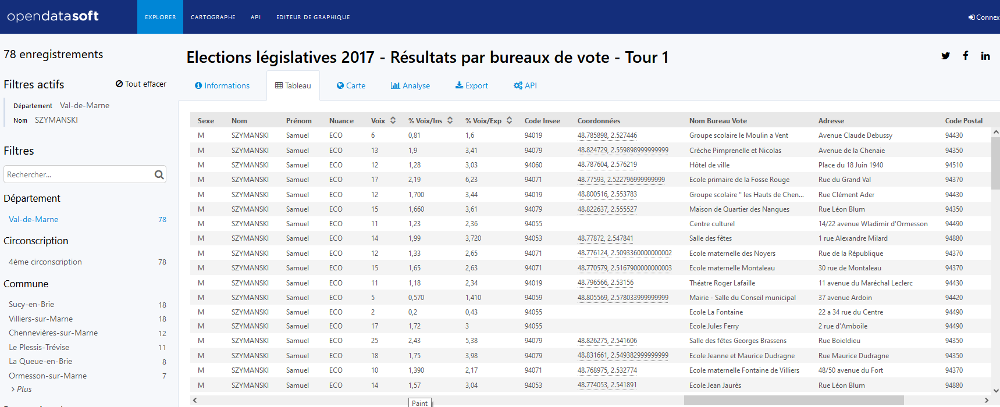

```{r setup, include=FALSE}

library(knitr)
library(rzine)
library(sf)
library(RColorBrewer)
library(mapview)
library(dplyr)
library(DT)
library(ggplot2)

## Global options
options(max.print="75")
opts_chunk$set(echo=FALSE,
	             cache=FALSE,
               prompt=FALSE,
               tidy=FALSE,
               comment=NA,
               message=FALSE,
               warning=FALSE,
               class.source="bg-info",
               class.output="bg-warning")

# opts_knit$set(width=75)
```


# Introduction {-}

L'objectif de ce document est de fournir des analyses objectives des résultats des dernières élections législatives afin de préparer dans les meilleures conditions la victoire des candidats écologistes et d'éviter une concurrence suicidaire entre listes de gauche. 

# Sources

## Résultats par bureau de vote

Les données détaillées du premier tour de l'élection de 2017 par bureau de vote sont accessibles via la plateforme *opendatasoft* en cliquant sur [ce lien](https://public.opendatasoft.com/explore/dataset/elections-legislatives-2017-resultats-par-bureaux-de-vote-tour-1/table/?disjunctive.libelle_de_la_commune). On peut explorer les données directement sur le site opendatasoft et constater qu'il existe même une localisation géographique des bureaux de vote, malheureusement incomplète.

Si par exemple on veut connaître les résultats de Samuel Szymanski et Eliane Simon, candidats EELV sur la 4e circonscription en 2017, on peut facilement obtenir un tableau fournissant les résultats détaillés et complets pour les 78 bureaux de vote :

```{r}

```
Par exemple, ces candidats ont obtenus 25 voix, soit 2.43% des inscrits et 5.38% des suffrages exprimés dans le bureau de vote n°1 de Villiers sur Marne localisé salle des fêtes Georges Brassens, rue Boildieu, situé au point de latitude 48.826275 et de longitude 2.541606. Il est donc possible de réaliser des cartes de géolocalisation précise des votes mais à deux réserves près :

- **le site fournit la position des bureaux de vote mais pas les contours des zones électorales** : le seul fichier de contours dont nous disposions date de 2007 et il n'est plus à jour dans la plupart des communes. On ne pourra donc faire que des cartes par point.
- **Certaines coordonnées de bureaux de vote sont manquantes** : Par exemple, dans le cas de la 4e ciconscription il manque les coordonnées des bureaux de vote d'Ormesson. Il est possible de les compléter mais cela prend un peu de temps.


## Circonscriptions

En dehors de la localisation des bureaux de vote, il est évidemment intéressant de pouvoir tracer le contour des circonscriptions électorales. Pour cela, on peut utiliser une autre ressource produite par Mapotempo et disponible sur le site *data.gouv.fr* en cliquant sur [ce lien](https://www.data.gouv.fr/fr/datasets/contours-detailles-des-circonscriptions-des-legislatives/) 

Le fonds de carte est légèrement généralisé (simplification du controur) pour faciliter la lecture des cartes, mais il se superpose facilement sur un fonds de repérage des rues de type Open Street Map et ne semble pas comporter d'erreurs dans le cas du Val-de-Marne. 


## Test de superposition

On peut effectuer un test de superposition des bureaux de vote sur le fonds de carte des circonscription pour repérer les géolocalisations manquantes.

```{r, echo=FALSE,}


map94<-readRDS("data/maps/circo94.RDS" )
map1 <- mapview(map94, col.regions=rainbow(n=11), alpha.regions=0.2, layer.name = "circonscriptions")


bv<-st_read("data/bv/bv.geojson", quiet=T)
bv2<- bv %>% select(circ=libelle_de_la_circonscription,
                    com=libelle_de_la_commune, 
                    bv_code = code_du_b_vote,
                    bv_nom = uniq_bdv,
                    bv_adr =adresse) %>%
            unique()
map2<-mapview(bv2,cex=4, layer.name="BdV localisés")
map1+map2
```


A première vue, il ne manque que 22 localisations sur les 813 bureaux de vote, ce qu devrait pouvoir être complété facilement.

```{r}
bv3<-bv2 %>% filter(is.na(st_coordinates(bv2)[,1])==T) %>% st_drop_geometry() %>% arrange(com,bv_code)

kable(bv3)
```

# La participation

## Résultats généraux


```{r, echo=FALSE}
tab1<-bv %>% select(circ=code_de_la_circonscription,
                    com=libelle_de_la_commune, 
                    bv_code = code_du_b_vote,
                    bv_nom = uniq_bdv,
                    inscrits,
                    votants,
                    blancs,
                    nuls,
                   exprimes) %>%
            unique() %>%
            arrange(circ,com,bv_code)
#datatable(tab1)
```


Deux critères permettent de mesurer les réticences des citoyens vis à vis des élections législatives

- **le refus de vote** : c'est à dire le pourcentage des inscrits qui ne sont pas allés votés aux dernières législatives
- **le refus de choix** : c'est-à-dire le pourcentage des votants qui ont refusé de choisir un candidat et ont préféré voter blanc ou nul.

Comme on peut le voir dans le tableau ci-dessous, ces critères sont très corrélés : les circonscriptions où le taux d'abstention est le plus fort sont aussi celles où la part des votes Blancs et Nuls parmi les suffrages exprimés est la plus élevée. 

```{r, echo=FALSE}
tab2 <-tab1 %>% group_by(circ) %>% summarise(inscrits=sum(inscrits),
                                             votants = sum(votants),
                                             blancs_nuls = sum(blancs)+sum(nuls),
                                             exprimes = sum(exprimes)) %>%
                               mutate(tx_abstention = 100*(inscrits-votants)/inscrits,
                                      tx_refusvote = 100*(blancs_nuls/exprimes))
kable(tab2,digits=c(NA,0,0,0,0,1,1))

```


La cartographie permet de mieux visualiser les circonscriptions concernées. Ce sont malheureusement les circonscriptions populaires orientées à gauche qui connaissent les plus fort taux de refus de vote ou de refus de choix, en particulier la 2e (Créteil-Orly-...), la 9e (Vitry-Alfortville-...) et la 3e (Villeneuve-Limeil-Boissy ...). A contrario,on observe une participation maximale dans la 8e (Charenton-Maison-Alfort-Joinville) et la 6e (St Mandé-Vincennes-Fontenay)


```{r}
tab2$REF<-paste("094",tab2$circ,sep="-")
tab2bis<-st_drop_geometry(tab2)
map<-left_join(map94,tab2bis) %>% mutate(tx_abstention = round(tx_abstention,2),
                                      tx_refusvote = round(tx_refusvote,2))


mapviewOptions(basemaps = c("CartoDB.Positron", "OpenStreetMap"),
               raster.palette = grey.colors,
               vector.palette = colorRampPalette(c("red", "lightyellow", "blue")),
               na.color = "magenta",
               layers.control.pos = "topright")


mw2<-mapview(map, zcol=c("tx_abstention") ,
            layer.name =c("% abstention"),
            map.types=c("CartoDB.Positron","OpenStreetMap")
            )
mw2
```

## Résultats par bureau de vote

```{r}
tab3 <-tab1 %>%  mutate(tx_abstention = round(100*(inscrits-votants)/inscrits,2),
                                      tx_refusvote = round(100*(blancs+nuls)/exprimes,2))
```

Même s'il manque encore quelques coordonnées de bureaux de vote, les cartes qui suivent montrent pour chaque circonscription les territoires qui votent *relativement* le plus ou le moins. Elles permettent de bien repérer les zones de refus de choix et de refus de vote ou inversement les zones de forte participation.


### 1ere circonscription

```{r}
selbv<-tab3 %>% filter(circ=="01")
selcir<-map94 %>% filter(REF=="094-01")
map01<-mapview(selcir,col.regions="lightyellow",alpha.regions=0.2)
bv01<-mapview(selbv, zcol=c("tx_abstention") ,
            layer.name =c("% abstention"),
            map.types=c("CartoDB.Positron","OpenStreetMap"))
map01+bv01
```


### 2eme circonscription

```{r}
selbv<-tab3 %>% filter(circ=="02")
selcir<-map94 %>% filter(REF=="094-02")
map02<-mapview(selcir,col.regions="lightyellow",alpha.regions=0.2)
bv02<-mapview(selbv, zcol=c("tx_abstention") ,
            layer.name =c("% abstention"),
            map.types=c("CartoDB.Positron","OpenStreetMap"))
map02+bv02
```


### 3eme circonscription

```{r}
selbv<-tab3 %>% filter(circ=="03")
selcir<-map94 %>% filter(REF=="094-03")
map03<-mapview(selcir,col.regions="lightyellow",alpha.regions=0.2)
bv03<-mapview(selbv, zcol=c("tx_abstention") ,
            layer.name =c("% abstention"),
            map.types=c("CartoDB.Positron","OpenStreetMap"))
map03+bv03
```


### 4e circonscription

```{r}
selbv<-tab3 %>% filter(circ=="04")
selcir<-map94 %>% filter(REF=="094-04")
map04<-mapview(selcir,col.regions="lightyellow",alpha.regions=0.2)
bv04<-mapview(selbv, zcol=c("tx_abstention") ,
            layer.name =c("% abstention"),
            map.types=c("CartoDB.Positron","OpenStreetMap"))
map04+bv04
```


### 5e circonscription

```{r}
selbv<-tab3 %>% filter(circ=="05")
selcir<-map94 %>% filter(REF=="094-05")
map05<-mapview(selcir,col.regions="lightyellow",alpha.regions=0.2)
bv05<-mapview(selbv, zcol=c("tx_abstention") ,
            layer.name =c("% abstention"),
            map.types=c("CartoDB.Positron","OpenStreetMap"))
map05+bv05
```


### 6eme circonscription

```{r}
selbv<-tab3 %>% filter(circ=="06")
selcir<-map94 %>% filter(REF=="094-06")
map06<-mapview(selcir,col.regions="lightyellow",alpha.regions=0.2)
bv06<-mapview(selbv, zcol=c("tx_abstention") ,
            layer.name =c("% abstention"),
            map.types=c("CartoDB.Positron","OpenStreetMap"))
map06+bv06
```


### 7eme circonscription

```{r}
selbv<-tab3 %>% filter(circ=="07")
selcir<-map94 %>% filter(REF=="094-07")
map07<-mapview(selcir,col.regions="lightyellow",alpha.regions=0.2)
bv07<-mapview(selbv, zcol=c("tx_abstention") ,
            layer.name =c("% abstention"),
            map.types=c("CartoDB.Positron","OpenStreetMap"))
map07+bv07
```


### 8eme circonscription

```{r}
selbv<-tab3 %>% filter(circ=="08")
selcir<-map94 %>% filter(REF=="094-08")
map08<-mapview(selcir,col.regions="lightyellow",alpha.regions=0.2)
bv08<-mapview(selbv, zcol=c("tx_abstention") ,
            layer.name =c("% abstention"),
            map.types=c("CartoDB.Positron","OpenStreetMap"))
map08+bv08
```


### 9eme circonscription

```{r}
selbv<-tab3 %>% filter(circ=="09")
selcir<-map94 %>% filter(REF=="094-09")
map09<-mapview(selcir,col.regions="lightyellow",alpha.regions=0.2)
bv09<-mapview(selbv, zcol=c("tx_abstention") ,
            layer.name =c("% abstention"),
            map.types=c("CartoDB.Positron","OpenStreetMap"))
map09+bv09
```


### 10eme circonscription

```{r}
selbv<-tab3 %>% filter(circ=="10")
selcir<-map94 %>% filter(REF=="094-10")
map10<-mapview(selcir,col.regions="lightyellow",alpha.regions=0.2)
bv10<-mapview(selbv, zcol=c("tx_abstention") ,
            layer.name =c("% abstention"),
            map.types=c("CartoDB.Positron","OpenStreetMap"))
map10+bv10
```


### 11eme circonscription

```{r}
selbv<-tab3 %>% filter(circ=="11")
selcir<-map94 %>% filter(REF=="094-11")
map11<-mapview(selcir,col.regions="lightyellow",alpha.regions=0.2)
bv11<-mapview(selbv, zcol=c("tx_abstention") ,
            layer.name =c("% abstention"),
            map.types=c("CartoDB.Positron","OpenStreetMap"))
map11+bv11
```

------------

à suivre...


-------

# Bibliographie {-}

<div id="refs"></div>


# Annexes {-}


## Infos session  {-}

```{r session_info, echo=FALSE}
kableExtra::kable_styling(kable(sessionRzine()[[1]], row.names = F))
kableExtra::kable_styling(kable(sessionRzine()[[2]], row.names = F))
```


## Citation {-}

```{r generateBibliography, echo=FALSE}

cat(readLines('cite.bib'), sep = '\n')

``` 

<br>

## Glossaire {- #endnotes}

```{js, echo=FALSE}

$(document).ready(function() {
  $('.footnotes ol').appendTo('#endnotes');
  $('.footnotes').remove();
});

```
